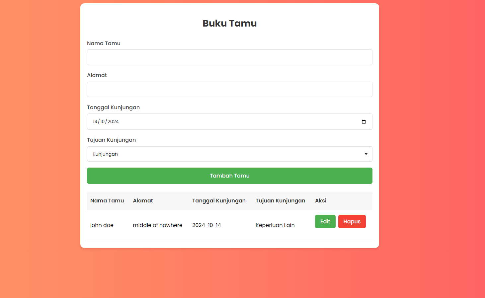

# Aplikasi Buku Tamu

Ini adalah aplikasi buku tamu sederhana yang dibangun menggunakan PHP dan SQLite.

## Fitur

- Menambahkan entri tamu baru (nama, alamat, tanggal, dan tujuan).
- Memperbarui entri tamu yang sudah ada.
- Menghapus entri tamu.

## Persyaratan

- PHP 7.x atau lebih baru
- SQLite 3.x

## Instalasi

1. Clone repository ini atau unduh file-file yang ada.
2. Pastikan PHP dan SQLite sudah terpasang di server.
3. Letakkan file-file di direktori root server.
4. Akses `index.php` melalui browser untuk mulai menggunakan aplikasi.

## Struktur File

- `index.php`: Mengatur logika untuk penambahan, pembaruan, dan penghapusan tamu.
- `function.php`: Berisi fungsi-fungsi untuk mengelola database SQLite.

## Penggunaan

- **Menambah Tamu**: Isi form dengan nama, alamat, tanggal, dan tujuan kunjungan tamu.
- **Memperbarui Tamu**: Masukkan ID tamu yang ingin diperbarui beserta informasi barunya.
- **Menghapus Tamu**: Masukkan ID tamu yang ingin dihapus.

## Kontribusi

Kontribusi selalu diterima! Kamu bisa bantu berkontribusi untuk membuat aplikasi ini menjadi lebih baik:

1. Fork repository ini
2. Buat branch baru (`git checkout -b fitur-baru`)
3. Commit perubahan Anda (`git commit -m 'Menambahkan fitur baru'`)
4. Push ke branch (`git push origin fitur-baru`)
5. Buat Pull Request

Dibuat dengan ❤️ oleh mas pai MEWING🤫🧏‍♂️
